---
tags:
  - 测试
---
# Mermaid 测试

13 种图，检查主题配色用(tools/mermaid_check.py 截图)：含 classDef 节点、子图、注释、loop / alt、分叉 / 选择、甘特关键任务 / 里程碑。

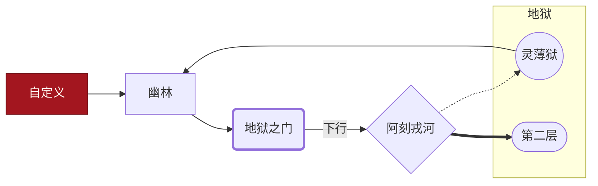
```mermaid
graph LR
  A[幽林] --> B(地狱之门)
  B -->|下行| C{阿刻戎河}
  C -.-> D((灵薄狱))
  C ==> E([第二层])
  D --> A
  subgraph 地狱
    D
    E
  end
  F[自定义]:::hot --> A
  classDef hot fill:#a3161f,stroke:#6e0c12,color:#fffaf1
  style B stroke-width:3px
```

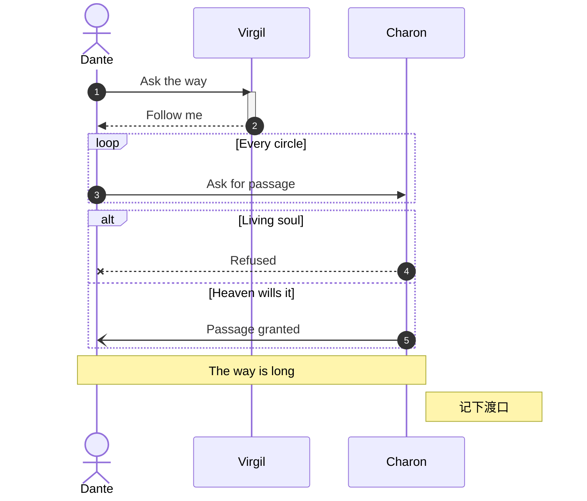
```mermaid
sequenceDiagram
  autonumber
  actor D as Dante
  participant V as Virgil
  participant C as Charon
  D->>V: Ask the way
  activate V
  V-->>D: Follow me
  deactivate V
  loop Every circle
    D->>C: Ask for passage
  end
  alt Living soul
    C--xD: Refused
  else Heaven wills it
    C-)D: Passage granted
  end
  Note over D,C: The way is long
  Note right of C: 记下渡口
```

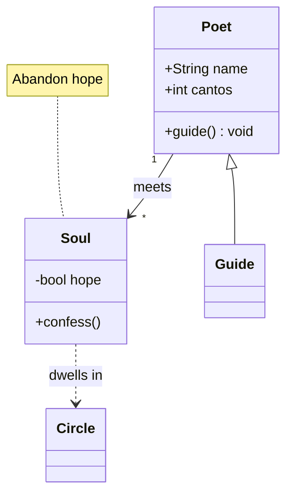
```mermaid
classDiagram
  class Poet {
    +String name
    +int cantos
    +guide() void
  }
  class Soul {
    -bool hope
    +confess()
  }
  Poet "1" --> "*" Soul : meets
  Poet <|-- Guide
  Soul ..> Circle : dwells in
  note for Soul "Abandon hope"
```

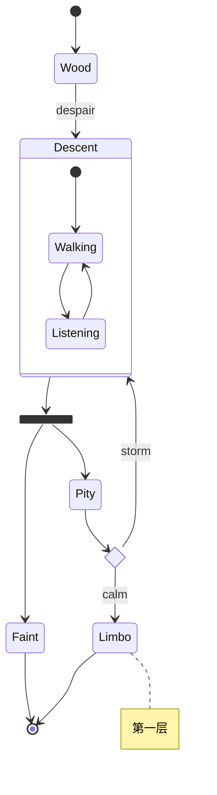
```mermaid
stateDiagram-v2
  [*] --> Wood
  Wood --> Descent : despair
  state Descent {
    [*] --> Walking
    Walking --> Listening
    Listening --> Walking
  }
  state fork1 <<fork>>
  Descent --> fork1
  fork1 --> Pity
  fork1 --> Faint
  state check <<choice>>
  Pity --> check
  check --> Limbo : calm
  check --> Descent : storm
  Faint --> [*]
  note right of Limbo : 第一层
  Limbo --> [*]
```

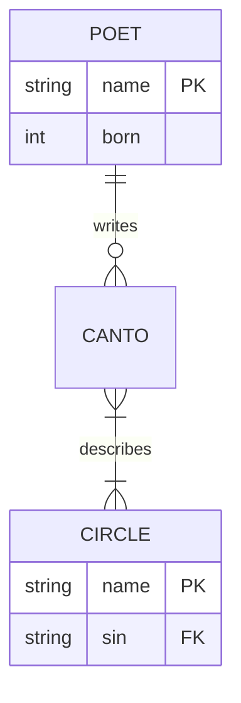
```mermaid
erDiagram
  POET ||--o{ CANTO : writes
  CANTO }|--|{ CIRCLE : describes
  POET {
    string name PK
    int born
  }
  CIRCLE {
    string name PK
    string sin FK
  }
```

```mermaid
gantt
  title The first night
  dateFormat HH:mm
  axisFormat %H:%M
  section Wood
    Lost in the wood :done, a1, 18:00, 30m
    Meet Virgil      :active, a2, after a1, 2h
  section Hell
    Through the gate :crit, b1, 19:00, 90m
    Second circle    :b2, after b1, 1h
    Faint :milestone, m1, 23:00, 0m
```

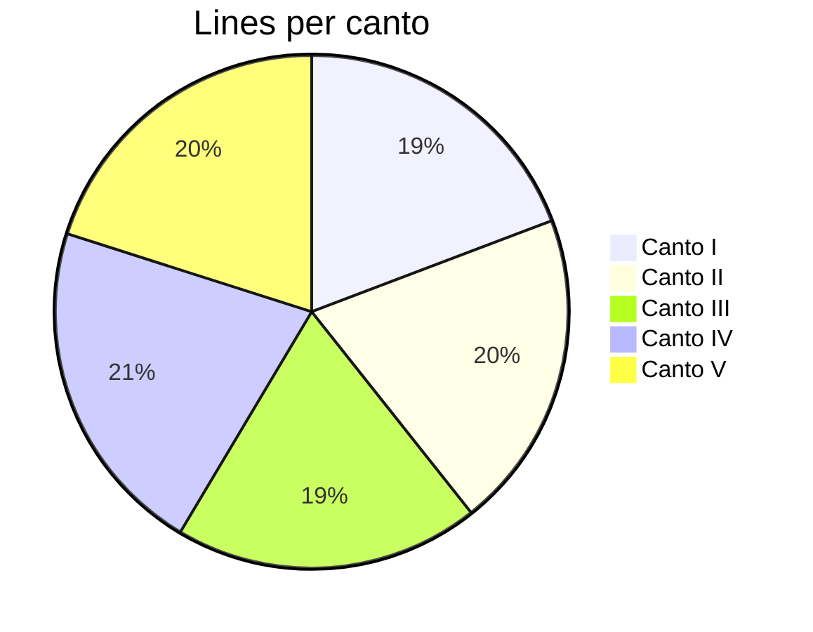
```mermaid
pie title Lines per canto
  "Canto I" : 136
  "Canto II" : 142
  "Canto III" : 136
  "Canto IV" : 151
  "Canto V" : 142
```

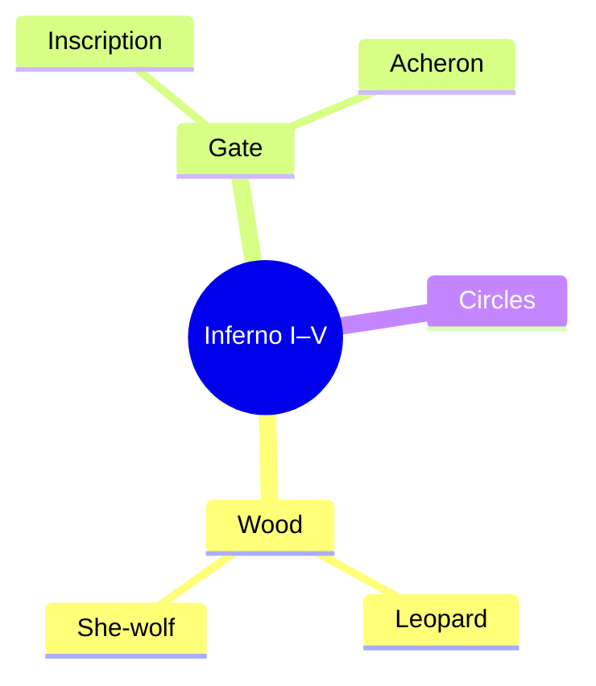
```mermaid
mindmap
  root((Inferno I–V))
    Wood
      Leopard
      She-wolf
    Gate
      Inscription
      Acheron
    Circles
```

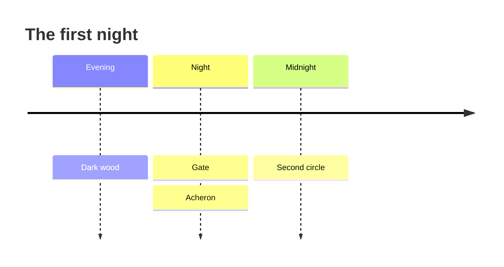
```mermaid
timeline
  title The first night
  Evening : Dark wood
  Night : Gate : Acheron
  Midnight : Second circle
```

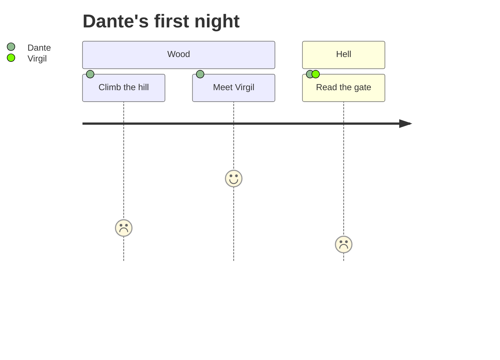
```mermaid
journey
  title Dante's first night
  section Wood
    Climb the hill: 2: Dante
    Meet Virgil: 5: Dante
  section Hell
    Read the gate: 1: Dante, Virgil
```

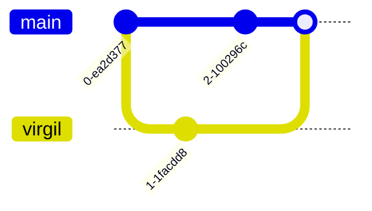
```mermaid
gitGraph
  commit
  branch virgil
  commit
  checkout main
  commit
  merge virgil
```

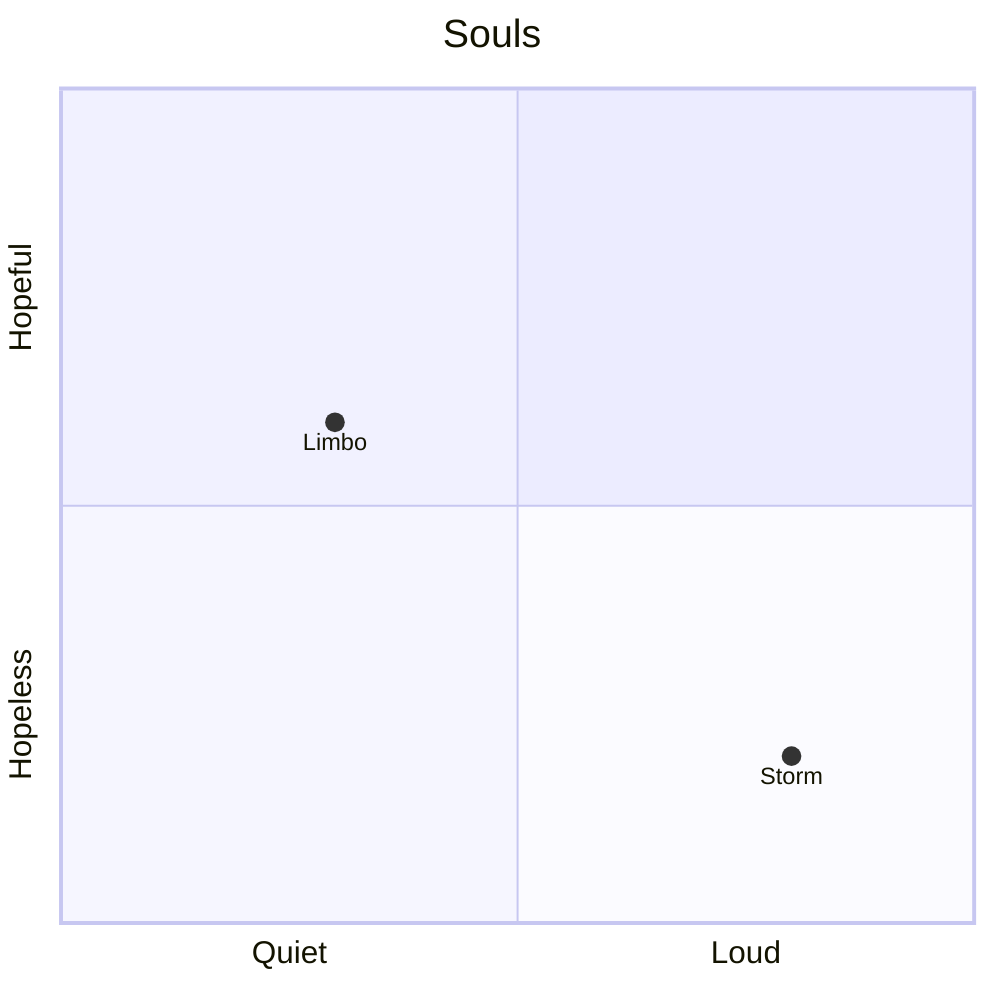
```mermaid
quadrantChart
  title Souls
  x-axis Quiet --> Loud
  y-axis Hopeless --> Hopeful
  Limbo: [0.3, 0.6]
  Storm: [0.8, 0.2]
```

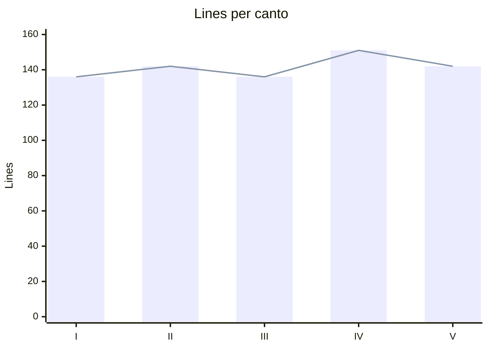
```mermaid
xychart-beta
  title "Lines per canto"
  x-axis [I, II, III, IV, V]
  y-axis "Lines" 0 --> 160
  bar [136, 142, 136, 151, 142]
  line [136, 142, 136, 151, 142]
```
